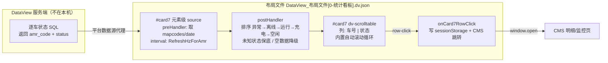

# 设计文档

## 概述

将统计看板「设备实时运行情况」模块（`#card7`，435×310，位置 x=26/y=456/z=37）从 `dv-chart` 柱状图改造为 `dv-scrolltable` 逐车滚动列表：每行展示一台车的**车号 + 状态**，超出可视区自动向上滚动循环。

设计核心是**复用**：本布局已有两个 `dv-scrolltable` 成功案例（`#chargedata`、`#taskavgdata`），它们已验证了组件级数据源、内置滚动、`row-click` 行点击与 CMS 跳转的完整链路。本设计把同一模式套用到 `#card7`，页面级柱状图数据源 `SQL1818567` 退役，改为组件级数据源消费服务端新提供的逐车状态查询。

**范围边界**：仅改前端布局文件 `DataView_布局文件[0-统计看板].dv.json`（元素定义、组件级 source、页面脚本、locales）；SQL 由服务端提供与执行，前端不直连数据库。

## 导向对齐

- **技术**：本仓库未建立 `.codex-specs/steering/tech.md`，无技术导向文档可对齐。实际以布局文件既有技术形态为准：DataView 低代码平台 JSON 布局 + 页面脚本（`this.$component` / `$model` / `$queryData`）+ 组件 props 配置，全部改动落在这一形态内。
- **结构**：未建立 `.codex-specs/steering/structure.md`。以既有结构为准：页面级 source（`content.option.sources` 与 `pages[0].sources` 双列表）+ 元素级 `option.sources` + `pages[0].script` 函数式处理器；滚动表格类组件一律用元素级 source（现状先例：`#chargedata`、`#taskavgdata`）。

## 代码复用分析

- **既有组件**
  - `dv-scrolltable`（`#chargedata` / `#taskavgdata`）：完整 props 模板（`scroll/speed/pageSize/pageInterval/rowHeight/thHeight/columns/filterRule/theme`）、元素级 source 模板（`interval: ${constant.RefreshHzForAmr}`、`preHandler` 取参、`postHandler` 二次查询与加工）、`row-click` 事件结构、`defaultValue` 样例数据。本设计整体复用此模式，仅换列定义与数据源。
  - 原 `#card7` 的状态色语义（运行=蓝绿 `#09C184→#0086FF`、异常=橙红 `#F86508→#DC9A6F`、离线=灰 `#666→#333`）：颜色语义迁移至列表状态着色，色值直接取自原柱状图 `itemStyle`。
  - `beforeSourceQuery_1`（页面脚本）：地图/日期取参逻辑（`#select0` → `mapcodes`、`#select1` → `date`）内联迁移至新组件级 source 的 `preHandler`。
  - `onCard7Click`（页面脚本）：`sessionStorage['device-status-param']` 参数结构与按 `CmsVersion`（3 / 4 / 4.1）分支的 CMS 跳转逻辑，整体复用到新的行点击处理器。
- **集成点**
  - 数据源机制：DataView 平台数据源（服务端 SQL 代理），前端经 `option.sources` 配置消费 —— 不新增任何直连。
  - 文案键：`locales` 列表新增 3 个键（见数据模型），沿用 `this.$text('$key')` / `columns.label: '$key'` 既有引用方式。
  - 刷新常量：`${constant.RefreshHzForAmr}`（与原柱状图一致）。
  - 导出：页面脚本 `downloadCsv` 的 `$exportComponentData(['#effectTrend', '#card6', '#card7', ...])` 保留 `#card7`，实现时验证 `dv-scrolltable` 是否支持导出，不支持则从列表移除该项。

## 架构



改动只发生在布局文件内部；服务端仅需按数据契约提供查询，双方以字段约定解耦。

## 组件与接口

### `#card7` 逐车滚动列表（`dv-scrolltable`）

- **职责**：在原柱状图位置渲染逐车状态文字行，自动滚动循环展示全部车辆。
- **接口（props）**
  - `columns`：两列 —— `{label: '$t3_carno', field: 'amr_code'}`、`{label: '$t3_status', field: 'status'}`，均 `show: true`。
  - `scroll: true`，`scrollType: 'scroll'`，`speed: 2`，`showPageIndex: false`（大屏不需要页码）；`pageSize`/`pageInterval` 初值取 `#chargedata` 同款（10 / 5），实现时按可视行数（约 7 行：`rowHeight 36` × 7 + 表头 40 ≈ 292 ≤ 310）校准。
  - `rowHeight: 36`，`thHeight: 40`，`fontSize: 12`，`border: false`，`stripe: true`，`theme: 'green'`，`innerPadding: 0` —— 均沿用现有两个滚动表，保证整屏风格一致。
  - `filterRule: {sort: [], style: []}`、`colors: []`、`enhance: ''`：初始为空；**状态着色**首选用 `filterRule.style` 按 `status` 字段条件设置文字色，实现首日用 `defaultValue` 样例数据在三种机制（`filterRule.style` → `colors` → `enhance` 钩子）中验证择优，选定后写死进配置（对应需求 1.3，备选顺序即降级顺序）。
  - `layout`：保持 `{x: 26, y: 456, w: 435, h: 310, z: 37}` 不变；`refName` 保持 `#card7`（标题元素 `#item20230612130352210` 与其余绑定无需改动）。
- **事件**：`row-click` → `onCard7RowClick`（结构复制自 `#chargedata` 的 `row-click`）。
- **依赖**：组件级 source、locales 键、页面脚本处理函数。
- **复用**：`#chargedata` 的全套 props/事件/option 骨架。

### 组件级数据源（`#card7.option.sources[0]`）

- **职责**：定时向服务端取逐车状态行数据，完成取参、排序与降级。
- **接口**
  - `source`：服务端新查询的 SQL ID —— 占位名 `SQL_AMR_STATUS_ROWS`（**实现时由服务端分配实际 ID 后替换**；后端不在本 spec 范围）。
  - `type: 'common'`，`map: false`（行数组直通），`interval: '${constant.RefreshHzForAmr}'`。
  - `preHandler`（内联代码，语义迁移自 `beforeSourceQuery_1`）：读 `#select0` → `mapcodes`（`ALL/all` 归一为 null）、`#select1` → `date`，写入 `$model` 并作为查询参数返回；实现时验证组件级 source 中 `this.$container.$component(...)` 的可用性（`postHandler` 已有此用法先例）。
  - `postHandler`（内联代码）：
    1. **排序**：按 `['异常','离线','运行','充电','空闲']` 优先级、同级 `amr_code` 升序（对应需求 4）。
    2. **未知状态**：不在五状态内的 `status` 原样保留、排在队尾、着色走默认（对应需求 2.3）。
    3. **空/错降级**：返回空数组或异常时返回占位行 `[{amr_code: '-', status: '暂无数据'}]`（对应需求 2.4；若组件内置空态文案合格则省略占位行，实现时二选一）。
    4. **防抖动**：比较新旧行序列，内容一致时返回上一次的同一数组引用，避免刷新触发重渲染导致滚动位置跳回顶部（对应需求 3.3）。
  - `defaultValue`：与数据契约同形的 8～10 行样例（覆盖五状态 + 未知状态），用于联调前的渲染/滚动/着色验证，不作为交付数据（对应需求 2.5）。
- **依赖**：服务端 SQL、`#select0/#select1`。
- **复用**：`#chargedata.option.sources` 的 `preHandler/postHandler/defaultValue` 骨架。

### 行点击处理器 `onCard7RowClick`（页面脚本）

- **职责**：行点击时记录参数并跳转 CMS。
- **接口**：入参为行数据 `e`（`row-click` 直接传行对象，先例 `onChargeRowClick = (e) => {...}`）。构造 `pm = {date, ranges, starttime, endtime, mapcodes, statusName: e.status, amr_code: e.amr_code}`，写入 `sessionStorage['device-status-param']`，随后按 `CmsVersion` 3 / 4 / 4.1 分支 `window.open` —— 分支逻辑从原 `onCard7Click` 原样复制。守卫：`e.status === '暂无数据'` 或行数据为空时不跳转（对应需求 5.2）。
- **依赖**：`$model('starttime'/'endtime'/'selrange')`、`this.form.mapcodes`、`render.$constant.CmsAddress/CmsVersion` —— 均为现状已有。
- **复用**：`onCard7Click` 的参数结构与跳转分支。

### 退役项（同批删除，防止死代码）

| 对象 | 位置 | 处置 |
| --- | --- | --- |
| `SQL1818567` 页面级 source（含 binds 柱状模板） | `content.option.sources` 与 `pages[0].sources` **两处列表** | 整条删除（两处都删，见错误处理 U1） |
| `beforeSourceQuery_1` | `pages[0].script` | 删除（仅被 `SQL1818567` 引用，已核实） |
| `onCard7Click` | `pages[0].script` | 由 `onCard7RowClick` 取代（原函数内柱状语义 `e.event.name` 不再存在） |
| `#card7` 的 `dv-chart` `props.options` / `click` 事件 | 元素定义 | 随 `elName` 改为 `dv-scrolltable` 整体替换 |

## 数据模型

**数据契约（服务端 → 前端）**：行数组，每行至少包含：

```json
{ "amr_code": "AMR-0123", "status": "运行" }
```

- `amr_code`：车号，字符串。
- `status`：`运行 | 空闲 | 充电 | 异常 | 离线` 之一；协议外值原样显示、默认色、排尾部。

**请求参数（前端 → 服务端）**：`mapcodes`（地图筛选，`ALL` 时为 null）、`date`（日期筛选）—— 与原 `SQL1818567` 入参一致。

**`sessionStorage['device-status-param']`（点击写入，结构对齐现状并扩展）**：

```json
{
  "date": "...", "ranges": "...", "starttime": "...", "endtime": "...",
  "mapcodes": "...", "statusName": "运行", "amr_code": "AMR-0123"
}
```

**locales 新增键**：

| key | zh-CN | en-US |
| --- | --- | --- |
| `t3_carno` | 车号 | Vehicle |
| `t3_status` | 状态 | Status |
| `noData` | 暂无数据 | No data |

**状态色映射（语义取自原柱状图）**：运行 = 蓝绿系；异常 = 橙红系；离线 = 灰系；空闲 / 充电 = 主色系（蓝）；未知状态 = 默认色。

## 错误处理

| 失败模式 | 可观测处理 |
| --- | --- |
| U1 双 source 列表不一致 | 布局文件存在 `content.option.sources` 与 `pages[0].sources` 两份页面级列表且已有历史分歧（多条 binds 不同）。运行时读取哪一份需在实现首日确认；处置：`SQL1818567` **两份都删**，新增数据源走元素级 `option.sources`（不在双列表内），规避该歧义。 |
| 服务端查询失败 / 超时 | `postHandler` try/catch 兜底，返回占位行「暂无数据」，不抛错、不阻断其它 source 轮询（对应需求 2.4、可靠性）。 |
| 返回空数组 | 同上，占位行；点击占位行不跳转。 |
| `status` 协议外取值 | 原样显示 + 默认色 + 排尾，行不丢（对应需求 2.3）。 |
| 刷新导致滚动跳顶 | `postHandler` 行序列未变时返回同一数组引用；若组件仍重渲染，降级方案为接受重置并在设计验证中记录（对应需求 3.3）。 |
| 着色机制不被组件支持 | 着色降级链：`filterRule.style` → `colors` → `enhance` 钩子；三者均不可用时以状态前缀符号（如 `● `）+ 文字色继承兜底，并回报需求方复审（需求 1.3 的保底）。 |
| 组件级 `preHandler` 作用域差异 | 以 `postHandler` 中 `this.$container.$queryData` 先例为准写代码；实现时用 `defaultValue` + 控制台验证取参，失败则改为页面级 source 的 `binds` 模板中转（备选路径）。 |
| `downloadCsv` 导出引用失效 | 保留列表中的 `#card7`，验证不支持时从 `$exportComponentData` 数组移除。 |

## 测试策略

本仓库无本地测试框架，验证以「样例数据离线验证 + DataView 平台运行验证」为主：

- **单元（纯逻辑，浏览器控制台即可验证）**：`postHandler` 的排序函数（五状态优先级 + 车号升级 + 未知状态排尾）、行序列 diff（同内容返回同引用）、点击守卫逻辑。
- **集成（DataView 平台，样例数据）**：`defaultValue` 注入后检查 —— 列表渲染、车号/状态两列、状态着色、超行自动滚动循环、未超行静止、行点击写入 `device-status-param`、占位行不跳转。
- **端到端（服务端 SQL 就绪后联调）**：
  1. 真实数据加载与滚动；
  2. `#select0/#select1` 切换后仅显示筛选内车辆；
  3. 连续观察 5 分钟刷新：无闪烁、滚动位置不跳顶；
  4. 断开服务端请求：显示「暂无数据」且其它模块不受影响；
  5. 整屏 `scale: true` 缩放下布局不错位（对比改造前截图）；
  6. 点击行按 `CmsVersion` 分支正确打开 CMS。

## 需求追踪表

| 需求 | 设计元素 |
| --- | --- |
| 1.1 | `#card7` 元素 `elName` 改为 `dv-scrolltable`，`layout`/`refName` 不变；标题元素不动 |
| 1.2 | `columns` 两列 `amr_code` + `status` |
| 1.3 | 状态色映射（复用原柱状图色值）；着色机制降级链 `filterRule.style` → `colors` → `enhance` |
| 1.4 | `scroll: true` / `scrollType: 'scroll'` 内置循环滚动 |
| 1.5 | 行数 ≤ 可视行数时组件静止（测试策略·集成第 4 点覆盖验证） |
| 1.6 | 退役项表：`dv-chart` props、`onCard7Click`、`SQL1818567`、`beforeSourceQuery_1` 全部移除 |
| 2.1 | 元素级 `option.sources` 走平台数据源代理；无任何直连配置 |
| 2.2 | 数据模型·数据契约字段定义 |
| 2.3 | `postHandler` 未知状态保底 + 排尾 |
| 2.4 | `postHandler` 空/错降级占位行；`noData` locale 键 |
| 2.5 | `defaultValue` 同形样例数据 |
| 3.1 | source `interval: ${constant.RefreshHzForAmr}` |
| 3.2 | `preHandler` 迁移 `mapcodes/date` 取参 |
| 3.3 | `postHandler` 行序列 diff 同引用返回 |
| 4.1 / 4.2 | `postHandler` 排序：优先级 + 车号升序，每次刷新重算 |
| 5.1 | `onCard7RowClick`：`device-status-param` + `amr_code` + CmsVersion 分支 |
| 5.2 | 占位行守卫不跳转 |
| 6.1 | `layout` 原值不动 |
| 6.2 | 深色底 + 白字 + `theme: 'green'` + `rowHeight 36`（约 7 行可视） |
| 6.3 | 滚动参数与现有组件同款；整屏缩放验证入测试清单 |
