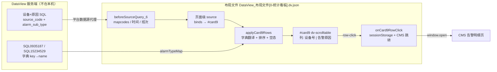

# 设计文档

## 概述

将统计看板「TOP20告警设备」模块（`#card9`，461×279，位置 x=500/y=780/z=20）从 `dv-chart` 柱状图改造为 `dv-scrolltable` 滚动列表：每行展示一个「**设备号 + 告警原因**」组合，同一设备可因不同原因出现多行，超出可视区自动向上滚动循环。告警次数不再展示。

设计核心是**复用**：同屏已有三条 `dv-scrolltable` 成功链路——`#card7`（最近改造，页面级 source + `applyCard7Rows` 行加工）、`#chargedata` / `#taskavgdata`（元素级 source + `postHandler` 字典翻译 + `row-click`）。本设计把 `#card7` 的「页面级 source 绑定 + 页面脚本加工」模式套到 `#card9`，并复用右侧「TOP20告警类型」已有的 `alarmTypeMap` 字典翻译，把 `alarm_sub_type` 编码翻成可读原因名。

**范围边界**：仅改前端布局文件 `DataView_布局文件[0-统计看板].dv.json`（元素定义、页面级 source 绑定、页面脚本、locales）。SQL 由服务端提供与执行；前端只消费数据契约。可参考服务端数据源导出 `DataView_DataMeta_Server_TAS接口服务等_7_20260929093032.dv.json` 确认字段与既有 SQL 形态。

## 导向对齐

- **技术**：本仓库未建立 `.codex-specs/steering/tech.md`。以布局文件既有技术形态为准：DataView 低代码 JSON 布局 + 页面脚本（`this.$component` / `$model` / `$queryData` / `sessionStorage`）+ 组件 props，全部改动落在这一形态内。
- **结构**：未建立 `.codex-specs/steering/structure.md`。以既有结构为准：页面级 source 同时维护 `content.option.sources` 与 `pages[0].sources` **双列表**；行加工逻辑放页面脚本函数（先例 `applyCard7Rows`）；CMS 跳转统一 `sessionStorage` + `CmsVersion` 分支。

## 代码复用分析

- **既有组件**
  - `dv-scrolltable`：props 模板直接取自 `#card7`（`scroll/scrollType/speed/pageSize/pageInterval/showPageIndex/border/stripe/rowHeight/thHeight/fontSize/columns/colors/theme`）。`#chargedata` 的 `row-click` 事件结构（`events[0].children[0].value = handlerName`）用于行点击。
  - 原 `#card7` 改造后的页面脚本模式：`applyCard7Rows`（归一化行字段 → 排序 → 空态占位 → `card.setData(rows)`）整体套用为 `applyCard9Rows`。
  - `onCard7RowClick` / `onChargeRowClick`：行对象入参、筛选上下文写入 `sessionStorage`、按 `CmsVersion`（3 / 4 / 4.1）`window.open` 的结构，复制为 `onCard9RowClick`。
  - `alarmTypeMap`（`$model`）：`beforeSourceQuery_7` 已用 `SQL0935187`（TAS-告警子类型，出参 `key`/`name`）构建，键为 `alarm_module||'-'||main_type_code||'-'||minor_type_code`（如 `1-3-7`），值为中文类型名。`#alarmTypeTopCard` 的图表 options 就是用它把编码翻成名称。**原因翻译直接复用此 map**，不新建字典查询（服务端未就绪时可补拉 `SQL15234529` 看板-告警子类型字典，同为 `key`/`name`）。
  - `beforeSourceQuery_6`：地图/日期/班次取参（`mapcodes`、`pmCase`、`time_start/time_end`、`rangeCase`、`range_start/range_end`）**原样保留**，继续驱动 card9 的数据请求。
- **集成点**
  - 数据源：页面级 source（现 `SQL14252827` 位点）改为消费「设备 × 原因」行查询；`resultFormat` 从 `map` 调整为 `list`（与 `SQL09091542`→`#card7` 一致），或沿用 map 但绑定模板内归一成行数组。
  - 文案键：`locales` 修改 `topDevices`（或新增 `$deviceAlarmReason`），新增列头键。
  - 刷新常量：`${constant.RefreshHz}`（与改造前 card9 一致，不改成 `RefreshHzForAmr`）。
  - 导出：`handleDownloadCsv` 的 `$exportComponentData` 列表当前未包含 `#card9`，保持不变。

## 架构



改动只发生在布局文件内部；服务端按契约提供查询，双方以字段约定解耦。

## 组件与接口

### `#card9` 滚动列表（`dv-scrolltable`）

- **职责**：在原柱状图位置渲染「设备号 + 告警原因」文字行，自动滚动循环。
- **接口（props）**
  - `columns`：两列 —— `{label: '$t4_device', field: 'source_code', show: true}`、`{label: '$t4_reason', field: 'reason_name', show: true}`；均 `width: ""`, `format: ""`, `manual: false`（结构同 `#card7`）。
  - `scroll: true`，`scrollType: 'scroll'`，`speed: 2`，`showPageIndex: false`（大屏）；`pageSize: 10`，`pageInterval: 5` 初值同 `#card7`，实现时按 279 高度校准（`rowHeight 36` × 5 + 表头 40 = 220，可视约 5 行；若需 6 行可将 `rowHeight` 调至 32）。
  - `rowHeight: 36`，`thHeight: 40`，`fontSize: 12`，`border: false`，`stripe: true`，`theme: 'green'`，`innerPadding: 0`，`showStyle: '0'` —— 与三张既有滚动表一致。
  - `colors`：可选按原因关键字着色（如原因名含「异常/故障」用橙红 `#F86508`）；首版可 `[]` 默认色，视觉验证后再加（不阻塞主流程）。
  - `layout`：保持 `{x: 500, y: 780, w: 461, h: 279, z: 20}`；`refName` 保持 `#card9`（标题模板 `#item20230612130623400` 只改 locales，不必改 id）。
- **事件**：`row-click` → `onCard9RowClick`（结构复制 `#card7` 的 `row-click`）。
- **option**：`dynamic: false`；`defaultValue` 提供 8～10 行样例（含同设备多原因、未知原因、空态），仅开发验证用。
- **依赖**：页面级 source 绑定、`applyCard9Rows`、`onCard9RowClick`、locales。
- **复用**：`#card7` 的 props/事件骨架 + `#chargedata` 的 `row-click` 结构。

### 页面级数据源（现 `SQL14252827` 位点，`id=20230625143018702`）

- **职责**：按筛选条件定时取「设备 × 原因」行，交给绑定模板。
- **接口**
  - `source`：服务端新查询 SQL ID —— 占位名 `SQL_CARD9_DEVICE_REASON`（**实现时由服务端分配实际 ID 后替换**）。若服务端选择**改造** `SQL14252827` 的 GROUP BY（增加 `alarm_sub_type`），前端只改绑定与组件，sourceId 可不变——以服务端交付为准。
  - `interval: '${constant.RefreshHz}'`，`preHandler: 'beforeSourceQuery_6'`（不改）。
  - `resultFormat: 'list'`（对齐 `#card7` 的 `SQL09091542`）。
  - `binds[0]`：`refName: '#card9'`，`template` 简化为 `return this.applyCard9Rows(data)`（**删除**现状误写的 `this.$component('#card7').setData(data)`）。
  - 双列表同步：`content.option.sources` 与 `pages[0].sources` **两处**同改。
- **依赖**：`beforeSourceQuery_6`、服务端 SQL。
- **复用**：`SQL09091542`→`#card7` 的 bind 形态。

### 行加工 `applyCard9Rows`（页面脚本）

- **职责**：把服务端行归一成表格行，翻译原因名，排序，处理空态，`setData`。
- **接口**（对齐 `applyCard7Rows`）
  1. 取 `this.$component('#card9')`，无则 warn 并返回 null。
  2. 归一入参：`Array.isArray(data)` / `data.data` / `data.list` 三种形态。
  3. 空数组 → 占位行 `[{source_code: '-', reason_name: '暂无数据'}]` 并 `setData`。
  4. 字段归一：`source_code`（兼容 `robot_code`/`amr_code`）缺失填 `'-'`；原因取 `reason_name`，若无则用 `alarm_sub_type` 查 `this.$model('alarmTypeMap')`，查不到则**原样显示编码**，编码也空则 `'未知原因'`。
  5. 排序：`source_code` 升序，同设备内 `reason_name` 升序。
  6. `card.setData(rows)` 并返回 `rows`。
- **依赖**：`$model('alarmTypeMap')`；若 map 为空则先 `this.$queryData('SQL0935187', null, 'list')` 或 `SQL15234529` 补拉（与 `beforeSourceQuery_7` 同源逻辑，失败则降级为原样编码）。
- **复用**：`applyCard7Rows` 的归一化/排序/空态骨架。

### 行点击 `onCard9RowClick`（页面脚本）

- **职责**：行点击写参并跳转 CMS 告警明细。
- **接口**（对齐 `onCard7RowClick`，保留原 `onCard9Click` 的 CMS 目标页）
  - 入参 `e` 为行对象。
  - 守卫：`e` 为空或 `reason_name === '暂无数据'` 时 return。
  - `pm = { date, ranges, starttime, endtime, mapcodes, source_code: e.source_code, reason_name: e.reason_name, alarm_sub_type: e.alarm_sub_type }`；写入 `sessionStorage['alarm-device-param']`（**修正**原 `pm.status = param.name` 的设备号误用）。
  - CMS 跳转分支**原样保留**原 `onCard9Click`：`CmsVersion` 3 → `cms_506010`；4 → `20230707084105967`；4.1 → 同页 https/iframe。
- **依赖**：`$model('starttime'/'endtime'/'selrange')`、`this.form.mapcodes`、`render.$constant.CmsAddress/CmsVersion`。
- **复用**：`onCard7RowClick` 结构 + 原 `onCard9Click` 的跳转 URL。

### 标题与文案

| 键 | 现值 | 新值 |
| --- | --- | --- |
| `$topDevices` | TOP20告警设备 / Top 20 Alarm Devices | 设备告警原因 / Device Alarm Reasons |
| `$t4_device`（新增） | — | 设备号 / Device |
| `$t4_reason`（新增） | — | 告警原因 / Reason |

标题模板 `#item20230612130623400` 的 `${this.$text('$topDevices')}` **不必改结构**，只改 locales 即可；若希望键名更贴切，可改为 `$deviceAlarmReason` 并同步模板（二选一，实现时定死一种）。

### 退役项（同批删除，防止死代码）

| 对象 | 位置 | 处置 |
| --- | --- | --- |
| `#card9` 的 `dv-chart` `props.options`（bar/ECharts 全量配置） | 元素定义 | 随 `elName` 改为 `dv-scrolltable` 整体替换 |
| `onCard9Click` | `pages[0].script` | 由 `onCard9RowClick` 取代（柱状 `e.event.name` 语义不存在） |
| 绑定模板中的 `#card7.setData(data)` | source binds | 删除（错误副作用） |
| 结果绑定里的 `field1/field2`（source_code/count）映射 | source binds | 由 `applyCard9Rows` 行数组取代 |
| Y 轴 `$times`「次」在 card9 的引用 | 原 chart options | 随图表配置删除（locales 键仍被其它模块使用则保留键本身） |

## 数据模型

**数据契约（服务端 → 前端）**：行数组，每行：

```json
{
  "source_code": "AMR-001",
  "alarm_sub_type": "1-3-7"
}
```

- `source_code`：设备号，字符串，必填（空则前端填 `-`）。
- `alarm_sub_type`：`alarm_module||'-'||main_type_code||'-'||minor_type_code`，字符串。
- 可选：服务端可直接给出 `reason_name`；若给出则前端不再查字典。
- **不返回、不展示** `count`；若服务端为排序需要内部聚合次数，可只用于 ORDER BY / LIMIT。

**前端展示行（`applyCard9Rows` 输出）**：

```json
{
  "source_code": "AMR-001",
  "alarm_sub_type": "1-3-7",
  "reason_name": "举升异常"
}
```

**字典映射（已有）**：`$model('alarmTypeMap')`：`{ "1-3-7": "举升异常", ... }`，由 `SQL0935187`（或 `SQL15234529`）构建。

**服务端 SQL 形态参考**（不在本 spec 实现；对齐 `SQL14252827` 筛选条件，改 GROUP BY）：

```sql
select source_code,
       alarm_module||'-'||main_type_code||'-'||minor_type_code as alarm_sub_type
from cms_alarm_log
where elc_map_code is not null and elc_map_code<>''
  and alarm_module = 1
  and alarm_classification in (0, 2)
  and end_date is not null
  and [elc_map_code in (${mapcodes})]
  and (CASE WHEN ${pmCase} = '1' THEN (begin_date between timestamp${time_start} and timestamp${time_end}) ELSE 1=1 END) = true
  and (CASE WHEN ${rangeCase} = '1' THEN (...)
            WHEN ${rangeCase} = '2' THEN (...)
            ELSE 1=1 END) = true
group by source_code, alarm_module, main_type_code, minor_type_code
order by source_code, alarm_sub_type
limit 100
```

入参与 `SQL14252827` 一致：`mapcodes, pmCase, time_start, time_end, rangeCase, range_start, range_end`，故 `beforeSourceQuery_6` 可原样复用。

## 错误处理

| 失败模式 | 可观测行为 |
| --- | --- |
| 服务端返回空 / 请求失败 | 列表显示 `[- | 暂无数据]`；不抛错、不影响其它模块轮询 |
| `alarmTypeMap` 缺失或键未命中 | `reason_name` 显示原始 `alarm_sub_type` 编码，或编码也空时「未知原因」 |
| `#card9` 组件未就绪 | `applyCard9Rows` warn 并返回 null（同 `applyCard7Rows`） |
| 点击「暂无数据」行 | 不写 sessionStorage、不跳转 |
| `CmsVersion` 未知 | 打印 `error version`，不跳转（与现状一致） |
| 刷新导致数据不变 | 若实现防抖（比较行序列后复用同一数组引用），避免滚动跳顶；否则接受与 `#card7` 当前同等的刷新行为 |

## 测试策略

- **单元（脚本逻辑，开发台验证）**
  - `applyCard9Rows`：map 形态 / list 形态 / 空数据 / 编码未命中字典 / 同设备多原因排序。
  - `onCard9RowClick`：占位行不跳转；正常行写入 `alarm-device-param` 含 `source_code` 与原因字段。
- **集成（布局 + 服务端联调）**
  - 切换 `#select0` / `#select1` / 班次后请求参数与列表内容联动。
  - `RefreshHz` 轮询下列表更新且滚动不跳顶。
  - 与 `#alarmTypeTopCard` 的原因名称一致（同源字典）。
- **端到端（大屏目视）**
  - 461×279 内 ≥5 行可读；超行自动滚动循环；深色底白字；标题为「设备告警原因」；无任何「次数/count/次」露出。
  - 点击行进入 CMS 告警明细（3 / 4 / 4.1 三个版本分支各验一次）。

## 需求追溯

| 需求 | 设计元素 |
| --- | --- |
| 1.1 位置渲染为列表 | `#card9` → `dv-scrolltable`，layout 不变 |
| 1.2 设备号+原因一行 | `columns` 两列；数据契约两字段 |
| 1.3 同设备多行 | 契约按设备×原因聚合；排序保证相邻 |
| 1.4 / 1.5 自动滚动 | `scroll: true` + 空态不滚动 |
| 1.6 不展示次数、改标题 | 退役 count 字段与 `$times` 轴；locales `topDevices` |
| 1.7 退役柱状死代码 | 退役项表：chart options / `onCard9Click` / field1-field2 |
| 2.1–2.5 数据契约 | 「数据模型」小节 + `SQL_CARD9_DEVICE_REASON` 占位 |
| 3.1–3.4 原因命名 | `alarmTypeMap` / `SQL0935187` / 兜底「未知原因」 |
| 4.1–4.3 筛选与刷新 | 复用 `beforeSourceQuery_6` + `${constant.RefreshHz}` |
| 5.1–5.3 排序与行数 | `applyCard9Rows` 排序；服务端 LIMIT |
| 6.1–6.3 点击交互 | `onCard9RowClick` + `alarm-device-param` + CMS 分支 |
| 7.1–7.4 布局视觉 | layout 不变；props 对齐 `#card7`；深色体系 |
| 8.1–8.2 绑定清理 | 删除 `#card7.setData`；整表替换 chart options |
